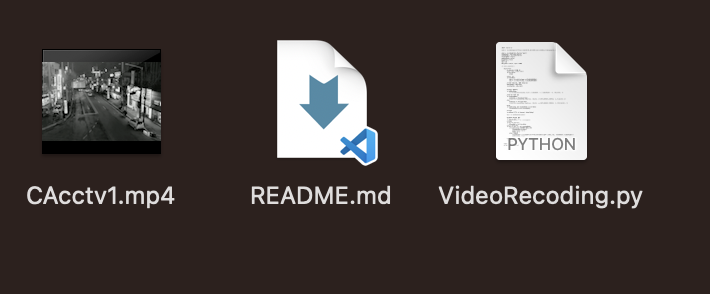

# 실시간 CCTV영상 녹화프로그램

이 프로젝트는 **누구나 접속 가능한 CCTV의 주소를 Python을 활용하여 실시간으로 보여주고, 녹화기능을 지원하는 프로그램**입니다.  
`OpenCV`를 활용하여 **실시간 스트리밍과 녹화/흑백 모드 기능**을 지원합니다.  

---

## 기능
✅ **실시간 CCTV 스트리밍**  
✅ **녹화 모드 (`space` 키)**  
✅ **녹화 기능 (MP4 저장)**  
✅ **흑백 모드 변환 (`b` 키)**  
✅ **녹화 중 테두리 표시 (`r` 키)** 
 
---

## 🎮 사용법 (단축키)

| 키  | 기능 | 이미지 |
|-----|------------------------------------|--------------------------|
| `ESC` | 프로그램 종료 | |
| `SPACE` | 실시간 스트리밍/녹화 모드  (Preview ↔ Recording) |   |
| `R` | 녹화 시작 / 중지 (녹화 중 빨간/검은 테두리 표시) |  |
| `B` | 흑백 모드 ON / OFF |    |

---

## 📂 녹화된 파일 저장 위치
녹화된 파일은 **현재 실행된 디렉토리**에 **MP4 파일**로 번호 순서대로 저장됩니다.

- `CAcctv1.mp4`
- `CAcctv2.mp4`
- `CAcctv3.mp4`
- ...

---
